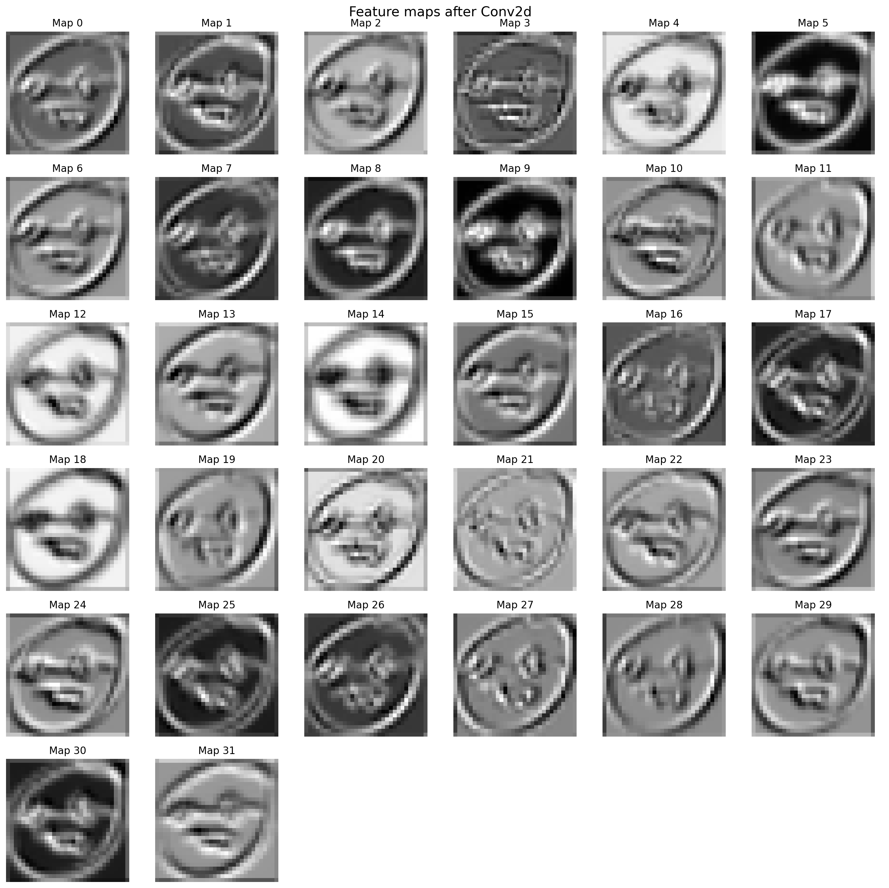
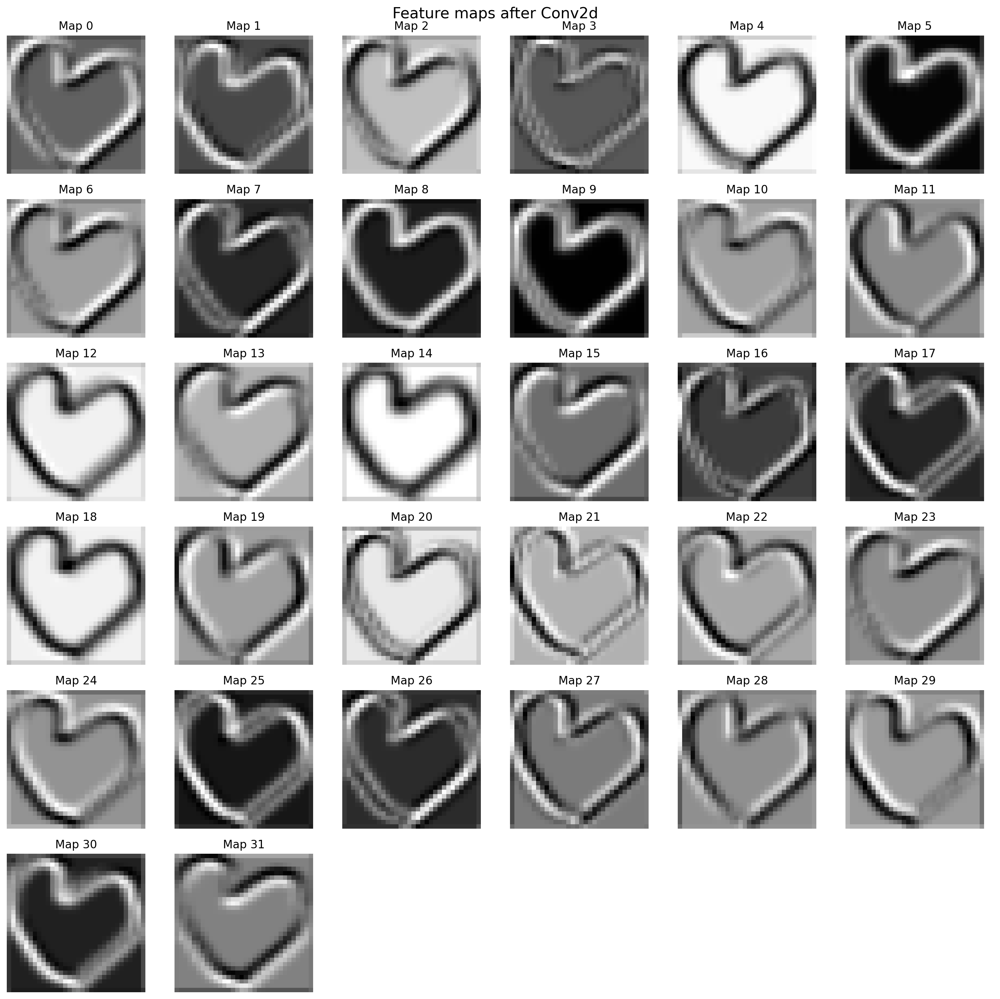

# TRONCHE

**Technical Recognition of Optical Networks for Complex Handrawn Emojis**

Classification d’émojis dessinés à la main (🙂, ☹️, ❤️, 😭, 🤓) avec un réseau de neurones convolutif sans librairie et avec **PyTorch**.


---

**Modèle sans librairies** : Le modèle est crée et exécuté dans `network/from_scratch/speedy_gonzales_code.py`

**Modèle avec PyTorch** : Le modèle se situe dans `network/with_pytorch/network.py` et est exécuté dans `network/with_pytorch/main.py`

**Données** : Elles sont situées dans `dataset/dataset-data`. Les images découpés sont dans `dataset/dataset-data/training-data`. Les scripts pour découper les images sont dans `dataset/dataset-generation`.

**Résultats** : Les résultats sont compilés dans `network/with_pytorch/benchmarks`. Les cartes caractéristiques sont compilées dans `network/with_pytorch/feat_maps.py`.




**Autre** : Il est possible de tester les modèles sur un ordinateur avec `draw_emoji.py`. Aussi, il y a plein de fichiers qui ne sont plus utilisés, mais qui ont été conservés pour laisser des traces de nos progrès.

## Installation

```bash
pip install -r requirements.txt
```
